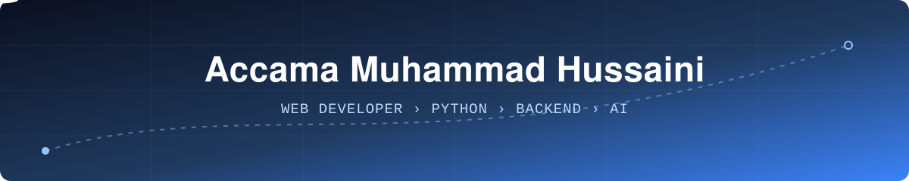

<!-- ✈️ Profile README for github.com/accamamuhammad -->

<div align="center">



<a href="https://github.com/accamamuhammad">
  
</a>

<br/>


</div>

<br/>

## 🛫 Flight Deck

```text
┌──────────────────────────────────────────────────────────┐
│  PILOT        Accama Muhammad Hussaini                   │
│  CALLSIGN     accama                                     │
│  BASE         Abuja, Nigeria                             │
├──────────────────────────────────────────────────────────┤
│  FROM         Full-stack web (Next.js, React, TS)        │
│  CURRENT      Python fundamentals  ▸ CS50P-guided        │
│  HEADING      Backend engineering  ▸ AI engineering      │
├──────────────────────────────────────────────────────────┤
│  FUEL         Curiosity ████████████████░░  Consistency  │
└──────────────────────────────────────────────────────────┘
```

I build for the web and I'm now deliberately widening my range. Python is the current focus, backend engineering is next, and AI engineering is the long-term heading. I'm doing the learning publicly, so everything below is labelled by what I've **used** versus what I'm **learning**.

<br/>

## 🧭 Flight Plan

| Leg | Route | Status |
| :-- | :-- | :-- |
| ✅ **Departed** | Full-stack web development with Next.js, Prisma, PostgreSQL | Shipped real projects |
| 🟡 **Cruising** | Python fundamentals: variables, type casting, iterators, file handling, modules | In progress |
| 🟡 **Cruising** | [CS50P](https://cs50.harvard.edu/python/) alongside independent practice projects | Planned / in progress |
| ⬜ **Next** | Backend engineering with Python (APIs, databases, architecture) | Upcoming |
| ⬜ **Destination** | AI engineering and the Python AI ecosystem | Long-term |

<br/>

## 📓 Pilot's Logbook

Currently logging my Python hours in the open:

<div align="center">

<a href="https://github.com/accamamuhammad/python-learning-journey">
  
</a>

</div>

```text
python-learning-journey/
├── 01-python-fundamentals/     variables · type casting · loops
├── 02-...                      iterators · file handling
└── ...                         modules · external libraries · small projects (e.g. alarm clock)
```

<br/>

## 🧰 Instruments

**🟢 Experience** (used in real projects)


**🟡 Learning now**


**⬜ Upcoming**


<br/>

## 🛩️ Previous Flights

<!-- Swap these for your best 2 to 4 repos. Pinned repos are the single most effective upgrade. -->

<div align="center">

<a href="https://github.com/accamamuhammad/REPO-NAME-1">
  
</a>
<a href="https://github.com/accamamuhammad/REPO-NAME-2">
  
</a>

</div>

<br/>

## 📡 Flight Telemetry

<div align="center">


</div>

<br/>

## 🎮 Off Duty

I like planes and I like games. Flight sims are the dream crossover, and I'd love to build something in that space once the Python fundamentals are solid.

<br/>

## 📬 Contact the Tower

<div align="center">

[](mailto:accamamuhammad@gmail.com)
[](https://x.com/YOUR_X_HANDLE)
[](https://t.me/WebDevDynasty)

<br/>

<sub>Open to freelance and collaboration on web projects. Currently learning Python in public.</sub>


</div>
